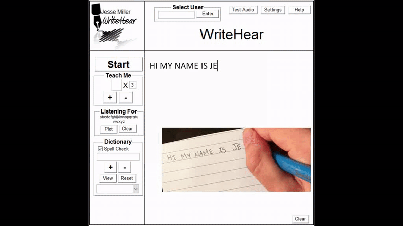

# WriteHear
Like Siri, but listens to the sound of handwriting instead. This MATLAB program listens to the sounds of pencil on paper (with a contact microphone) and transcribes what was written (using dynamic time warping algo).

See `WriteHear.pdf` for more detail.

